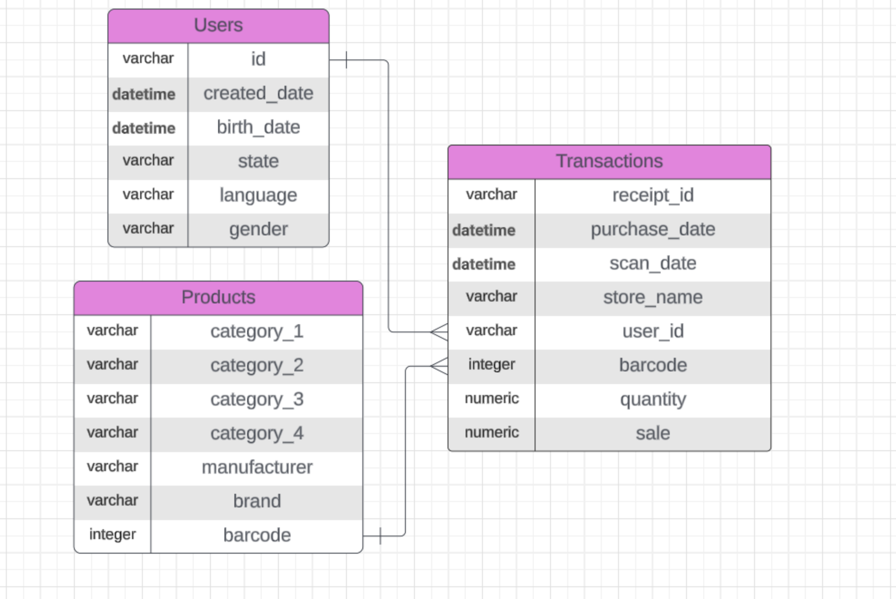

# Fetch Data Analyst Take Home Exercise
This is the solution of Fetch - Data Analyst Take Home exercise.

## Target
Demonstrate the candidate's ability to reason about data and how they communicate their understanding of a specific data set to others.

## Final Solutions
- Final solutions for Data Exploration and SQL Queries: [solution.ipynb](./submissions/solution.ipynb)
- Final email for Communications: [email.md](./submissions/email.md), attachment mentioned in the email: [attachment.md](./submissions/attachment.md)

## Requirements for Running the Code
To run the codes and see the outputs of [solution.ipynb](./submissions/solution.ipynb), you need to follow the steps:
1. Create an environment with Python=3.10, use pip to install packages listed in [requirements.txt](./requirements.txt).
2. Download three csv files from [Here](#Data)
and put it into `./data`.
3. Run the first part (1. Data Exploring) in [solution.ipynb](./submissions/solution.ipynb) to explore and clean the data.
4. Download and install SQLite3, run `./scripts/load_data.sh` to create SQLite database.
5. Run the second part (2. Load Data to Database & Connect to the Database) in [solution.ipynb](./submissions/solution.ipynb).
6. Run SQL queries in the third part (3. Provide SQL Queries) in [solution.ipynb](./submissions/solution.ipynb) to explore and clean the data.

## Exercise
### I. Data Exploration
Review the unstructured csv files and answer the following questions with code that supports your conclusions:
- Are there any data quality issues present?
- Are there any fields that are challenging to understand?

It is recommended using SQL or python and data visualization to examine the data.

### II. Provide SQL Queries
Answer three of the following questions with at least one question coming from the closed-ended and one from the open-ended question set. Each question should be answered using one query.

Closed-ended questions:
- What are the top 5 brands by receipts scanned among users 21 and over?
What are the top 5 brands by sales among users that have had their account for at least six months?
- What is the percentage of sales in the Health & Wellness category by generation?

Open-ended questions: for these, make assumptions and clearly state them when answering the question.
- Who are Fetch’s power users?
- Which is the leading brand in the Dips & Salsa category?
- At what percent has Fetch grown year over year?

### III. Communicate with Stakeholders
Construct an email or slack message that is understandable to a product or business leader who is not familiar with your day-to-day work. Summarize the results of your investigation. Include:
- Key data quality issues and outstanding questions about the data
- One interesting trend in the data
    - Use a finding from part 2 or come up with a new insight
- Request for action: explain what additional help, info, etc. you need to make sense of the data and resolve any outstanding issues

## Data
- Users: [DOWNLOAD CSV](https://fetch-hiring.s3.amazonaws.com/data-analyst/da_take_home/USER_TAKEHOME.csv)
- Transactions: [DOWNLOAD CSV](https://fetch-hiring.s3.amazonaws.com/data-analyst/da_take_home/TRANSACTION_TAKEHOME.csv)
- Products: [DOWNLOAD CSV](https://fetch-hiring.s3.amazonaws.com/data-analyst/da_take_home/PRODUCTS_TAKEHOME.csv)

## Entity Relationship Model
