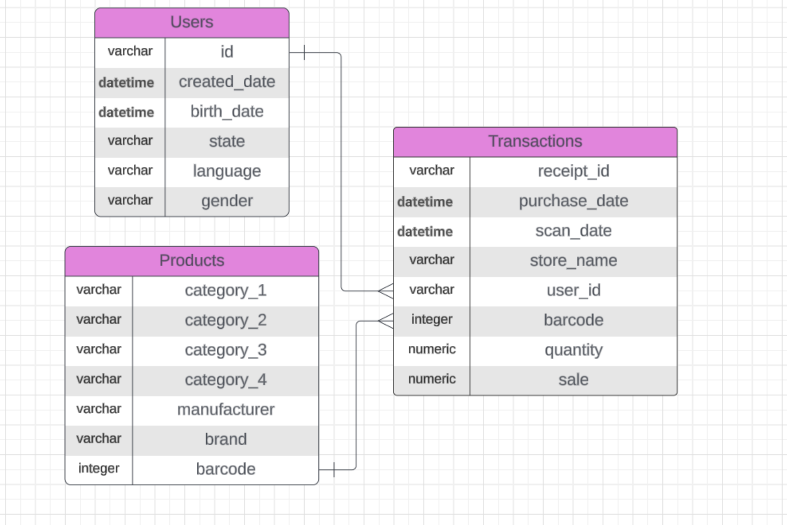

# Data Investigation Results
This document is a summary report of the investigation results of the three datasets.

## I. Executive Summary

## II. Business Background
Three datasets were provided as csv files. These data was collected from an app called Fetch that users upload receipt for reviews. The data can be analyzed for brands, retailers, and consumer packaged goods (CPG) companies to help them understand consumer behavior, optimize marketing strategies, and drive sales through targeted promotions.

## III. Dataset Description

## IV. Key Data Quality Issues
After exploring the data, some quality issues were found.

### 1. Completeness Issues
Missing values, incomplete records, and gaps in data:
1. 

### 2. Consistency Issues
Duplicate entries, inconsistent formatting, and naming variations:

### 3. Accuracy Issues
Incorrect, outdated, or erroneous data:

### 4. Structural Issues
Incorrect data types, unstructured data, and format mismatches:

### 5. Compliance & Privacy Issues
Sensitive data exposure, regulatory non-compliance, and security risks.

## V. Questions About Data

## VI. Interesting Trend in The Data

## VII. New Insight

## VIII. Request for action

Key data quality issues and outstanding questions about the data
One interesting trend in the data
Use a finding from part 2 or come up with a new insight
Request for action: explain what additional help, info, etc. you need to make sense of the data and resolve any outstanding issues